# yolov5 模型训练

yolov5 是一个优秀的开源目标检测模型.

我们在AS中集成了它, 版本为  yolov5s-3.0

模型训练分为两个步骤:

- 1. 数据集标注

- 2. 训练

接下来,我们通过文档的形式,详细来了解如何完成这两个步骤.

## 数据集格式

如果您使用AS提供的标注工具,标注后将自动生成如下格式的数据包.

### 说明


::: warning 数据集格式必须如下
- 如果您想通过AS服务器 或者 AS提供的镜像 训练模型

那么数据集必须包含以下3个部分(images,labels,tag.txt)
:::

 - images  用于存放图片
```txt
 > images下图片格式没有要求, jpg,jpeg,png 都可以
 > 文件名称:无要求
```
 - labels 用于存放 图片对应的标签,格式如下:
 ```txt
0 0.30974264705882354 0.52625 0.07169117647058823 0.09
1 0.7256433823529411 0.453125 0.4163602941176471 0.11291666666666667
 ```
 - tags 用于存放标签名称列表
 ```txt
nc: 5
names: ["小人","方块","圆形","唱片机","杯子"]
 ```

如图:

 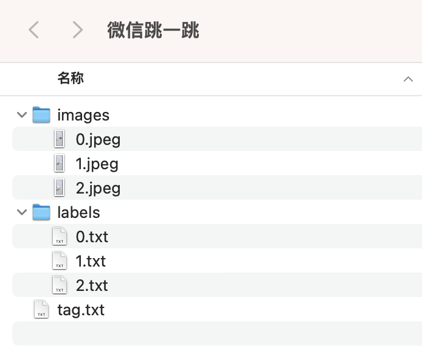


## 标注

打开WEB编辑器 - 工具栏 - yolo目标检测 -标注训练

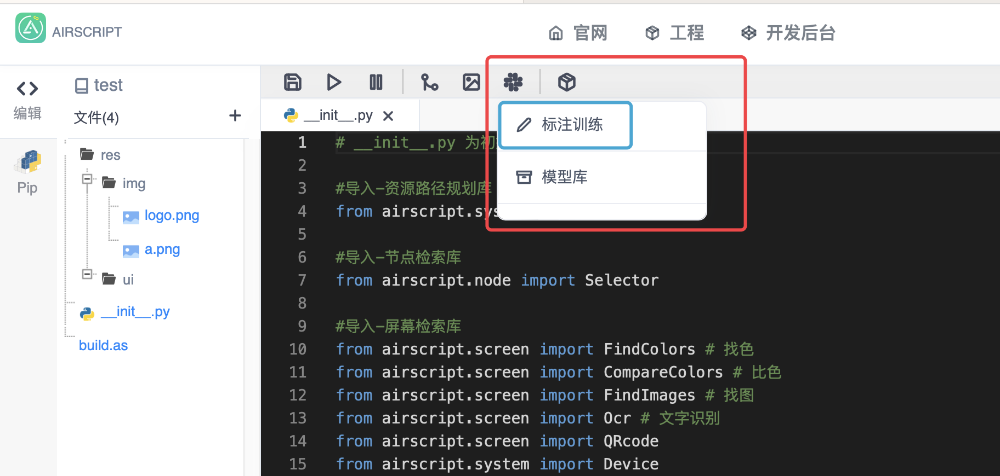

### 创建标注集

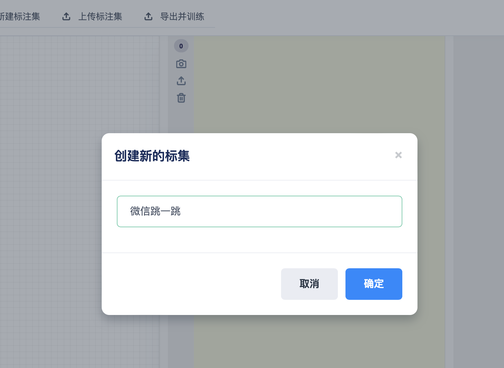

### 截屏/上传存入标注库

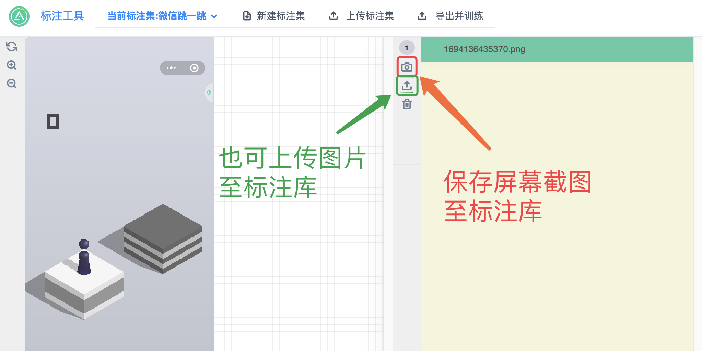

### 打标签

理论来讲,
在数据集中图片越多,训练的结果识别效果越好.

因此我们尽可能的要在不同的图片中多打标签.

同一个目标,用相同的标签名称即可.

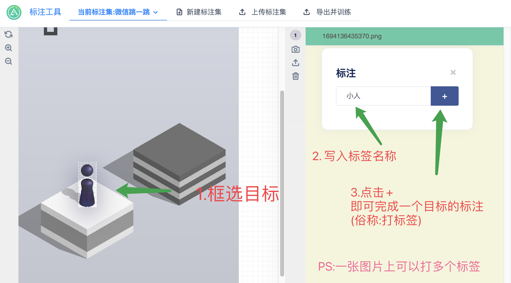

### 疯狂打标签

图片越多越好,搞多多滴

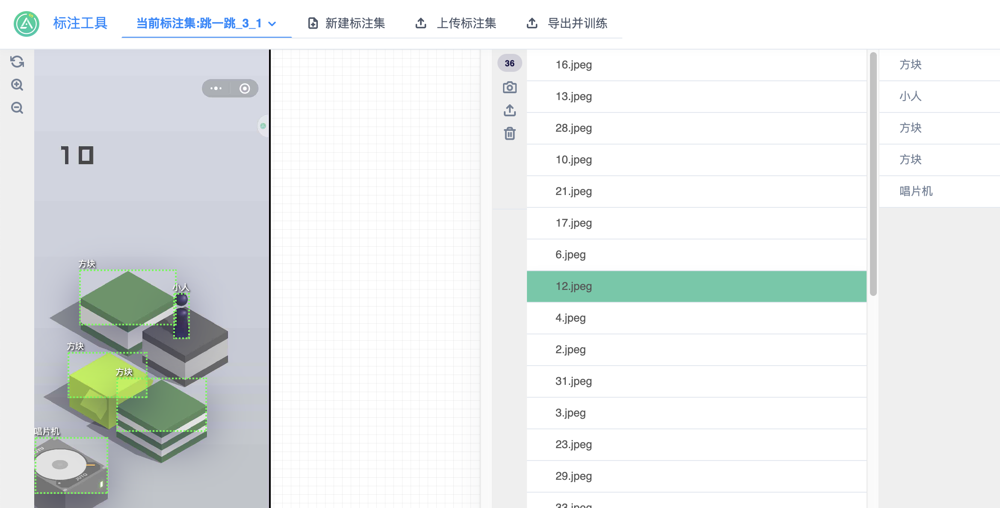

### 导出标注集

标注工具 - 工具栏 - 导出并训练

按照这个步骤操作,你会得到 一个 cnp文件(数据集的压缩包)

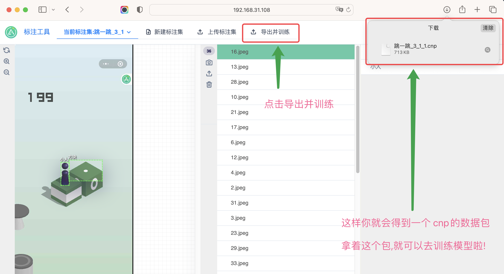


## 训练

训练分为两种模式

AirScript 提供的云服务训练

自建服务器训练

### AS服务器训练

前往 [开发者后台](http://py.airscript.cn/admin/model/list/create) 新增模型训练

填写信息,上传cnp数据集,点击提交.等待训练结果.

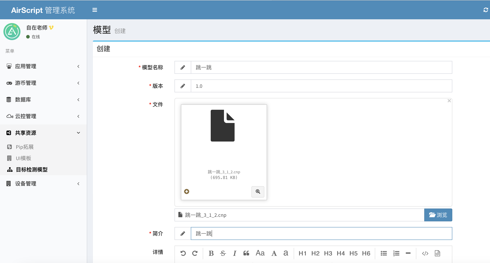

等待训练成功,即可加载使用了(50图左右,需训练30分钟左右)

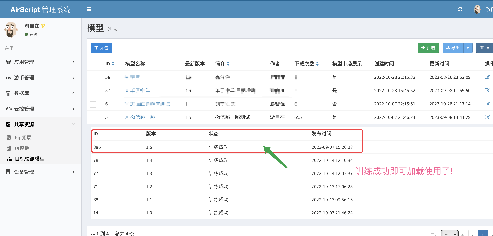

#### 训练完成后加载

```python
from airscript.screen import yolo_v5
# 注意,这里的 ‘微信跳一跳’就是训练的模型名称,1.5是模型的版本(需替换成你自己的模型与版本)
yolo = yolo_v5("微信跳一跳:1.5")
res = yolo.find_all()
for r in res:
    print(r)
```

### 大数据集训练(自建服务器)

大数据集,一般只1000张图以上的数据集.

这时候我AS的服务器训练会比较慢,各位开发者可以自行搭建服务器.

AS 提供 阿里云训练镜像给各位开发者.

1.获取镜像文件

"您需要先获得阿里云的账号ID,然后联系我们的客服企业微信,进行分享."

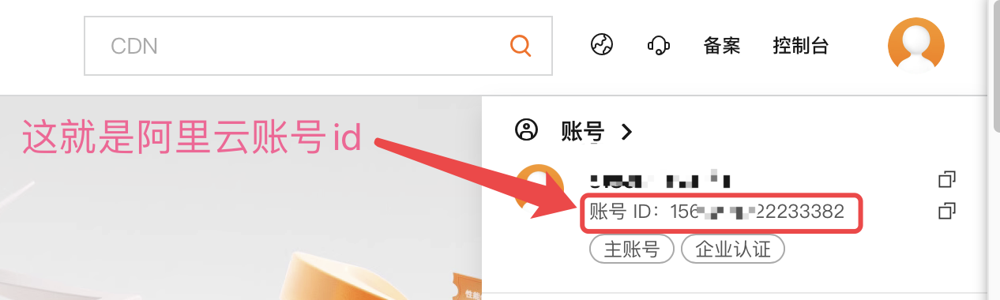

客服企业微信


2. 根据服务器镜像,创建 实例.

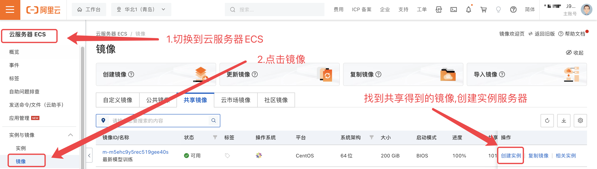

3. 模型训练服务器使用前准备

 ``` python

#从宿主机进入到模型训练容器
[root@test ~]# dockerexec -ite8d4e63b8c6d /bin/bash

#启动cron服务
[root@e8d4e63b8c6d:/usr/src/app# /etc/init.d/cron start
* Starting periodic command scheduler cron

 #返回宿主机
[root@e8d4e63b8c6d:/usr/src/app# exit
  exit

#从宿主机进入到模型转换容器
 [root@test ~]# dockerexec -it 618381dfd1a9 /bin/bash

 #启动cron服务
 [root@618381dfd1a9:/usr/src/app# /etc/init.d/cron start
  * Starting periodic command scheduler cron

 #返回宿主机
 [root@618381dfd1a9:/usr/src/app# exit
 exit
 [root@test ~]#
 ```

4. 进入管理后台,开始上传训练
- http://你服务域名
-  账号：  test
-  密码：  test

